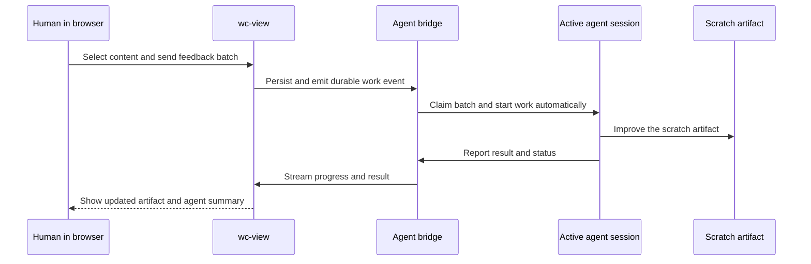
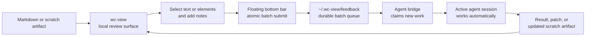

# wc-view — Team Training: Introducing It Into Every Engineer’s Workflow

> A local Markdown review surface where browser feedback starts agent work — without a second chat prompt.

## 1) What wc-view is

- Localhost UI for reviewing Markdown files and docs trees.
- Built for agent workflows, not generic document publishing.
- Keeps Markdown as the authoritative source.
- Stores feedback in user-local state under `~/.wc-view/feedback/`.
- Uses feedback submission as the trigger for a connected agent to start work.
- Returns progress and the latest result to the same browser surface.

## 2) The experience we are building



**The user should not have to return to the terminal to wake the agent up.** Browser feedback is the handoff.

## 3) Why this matters to the team

| Usual friction | wc-view response |
|---|---|
| Docs are read as static text | Render them as a focused review surface |
| Feedback gets lost in chat | Attach notes directly to selected content |
| Agents guess what feedback refers to | Anchor feedback to exact text + context |
| Review state pollutes repos | Keep queue state outside git in `~/.wc-view/` |
| User must prompt again after browser feedback | A connected agent bridge claims new batches automatically |

## 4) Product mental model



## 5) The per-engineer habit to adopt

### Before implementation

- Visualize a design doc, plan, or scratch artifact.
- Review it in the browser instead of only in raw Markdown.
- Capture precise notes on exact sections.

### During an artifact review

- Select content, add notes, and send one batch.
- Stay in the browser while the connected agent claims and processes feedback.
- Read the status and result in the same review surface.
- Send follow-up notes only when another iteration is needed.

### After the agent responds

- Scratch artifacts: review the automatic update.
- Authoritative Markdown or project files: inspect the proposed change and explicitly accept it before mutation.

## 6) Commands the team should remember

```bash
wc-view serve docs/
wc-view serve docs/design/architecture/wc-view-system-flow.md
wc-view serve .wc-view-scratch-training.md
wc-view feedback --unresolved
wc-view gc
```

## 7) Recommended team use cases

| Use case | How to use wc-view |
|---|---|
| Architecture review | Serve one design doc or a docs tree |
| Training/demo | Serve a synthesized scratch file with Mermaid diagrams |
| Acceptance-criteria review | Annotate exact lines/sections before coding |
| Human-in-the-loop agent iteration | Send browser feedback; the connected agent starts work |
| Cleanup | Garbage-collect resolved queue items |

## 8) Guardrails

- Markdown remains authoritative.
- Browser feedback automatically starts alignment work; it does not automatically approve repository changes.
- Scratch artifacts may be updated automatically after feedback is sent.
- Design docs, source code, configuration, and external side effects still require explicit human acceptance before mutation.
- Viewer binds to `127.0.0.1` only.
- Feedback state stays outside the repository.
- Machine-readable output belongs on `stdout`.
- Diagnostics belong on `stderr`.

## 9) 30-minute training agenda

| Time | Segment |
|---|---|
| 5 min | What wc-view is and why it exists |
| 5 min | Product mental model |
| 10 min | Live demo: serve, annotate, automatic agent response |
| 5 min | How each engineer should use it weekly |
| 5 min | Team Q&A and adoption checklist |

## 10) Rollout message for the team

- Use `wc-view` whenever a Markdown artifact needs review.
- Prefer a scratch visualization when explaining architecture, process, or flow.
- Keep feedback anchored in the document, not scattered across chat.
- Treat batch submission as the signal that starts the connected agent.
- Let scratch artifacts improve automatically; require explicit acceptance for authoritative project changes.

## 11) Success criteria for adoption

- Engineers review docs in `wc-view`, not only in raw editors.
- Feedback references exact content, not vague paragraphs in chat.
- Sending browser feedback starts connected agent work without a second chat prompt.
- The browser visibly reports queued, claimed, working, and terminal result states.
- Each submitted batch preserves its prompt, every attached note, and their anchors.
- Scratch artifacts update automatically or show a visible failure result.
- Protected project artifacts show a reviewable result and require explicit acceptance before application.
- A restart does not lose queued work or process a non-expired claim twice.
- Final accepted changes land back in Markdown.
