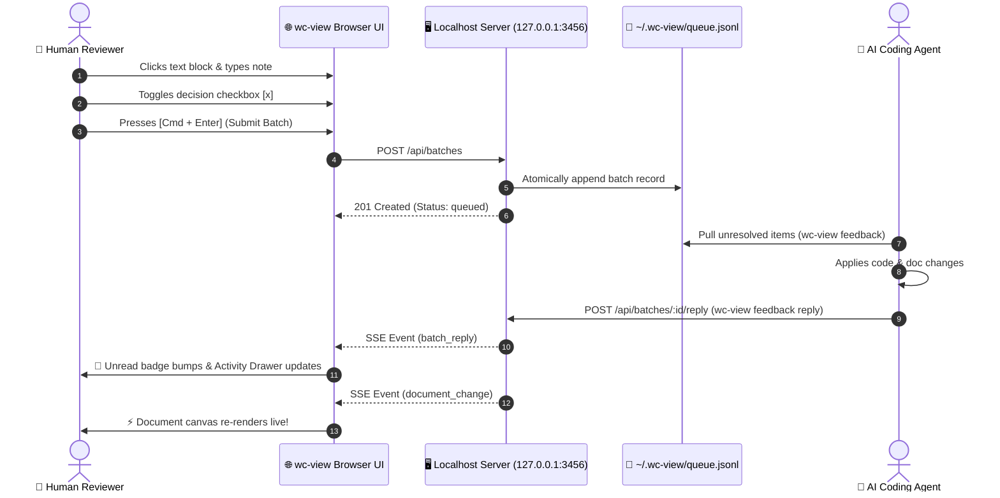

# 🚀 wc-view: System Architecture & Visual Project Overview

> **Interactive Review Surface**: Click any paragraph or code block to leave notes, toggle checkboxes to stage decisions, or open the **💬 Feed** drawer to view live agent dialogues.

---

## 🏗️ Interactive Design Decisions

Select the architecture choices to stage feedback for the agent:

- [x] **Zero Repo Pollution**: Feedback state stored in user-local `~/.wc-view/`
- [x] **Loopback Binding**: Restrict server exclusively to `127.0.0.1` for local security
- [x] **Live Hot-Reloading**: Real-time SSE synchronization on disk edits
- [ ] **Optional Cloud Relay**: Enable encrypted remote pairing via `wc-view share`
- [ ] **Offline Standalone Bundling**: Single-file HTML export with embedded Mermaid runtime

---

## 🧭 System Workflow & Data Flow



---

## 🔍 Code Diff Syntax Highlighting Preview

Here is an example patch showing the new `POST /api/batches/:id/reply` endpoint:

```diff
@@ -280,6 +280,18 @@
       return;
     }
 
+    const replyMatch = pathname.match(/^\/api\/batches\/([^/]+)\/reply$/);
+    if (req.method === "POST" && replyMatch) {
+      readJsonBody(req, res, (body) => {
+        const { message, sender } = JSON.parse(body);
+        const batch = addAgentReply(decodeURIComponent(replyMatch[1]), message, sender);
+        broadcast("batch", batch);
+        res.writeHead(200, { "Content-Type": "application/json" });
+        res.end(JSON.stringify(batch));
+      });
+      return;
+    }
```

---

## 📊 Core Subsystems & Status

| Layer | Responsibility | Key Module | Status |
| :--- | :--- | :--- | :---: |
| **CLI** | Commands for `serve`, `export`, `feedback`, and `gc` | [`src/cli/index.ts`](file:///Users/astrojose/Code/wc-visualize/src/cli/index.ts) | ✅ Production Ready |
| **Server** | Local loopback HTTP server with SSE live broadcasting | [`src/server/index.ts`](file:///Users/astrojose/Code/wc-visualize/src/server/index.ts) | ✅ Production Ready |
| **Core State** | Atomic JSONL lock management & queue retention | [`src/core/queue.ts`](file:///Users/astrojose/Code/wc-visualize/src/core/queue.ts) | ✅ Production Ready |
| **Export Engine** | Zero-dependency standalone HTML compilation | [`src/core/export.ts`](file:///Users/astrojose/Code/wc-visualize/src/core/export.ts) | ✅ Production Ready |
| **Client UI** | DocCanvas, Sidebar, Activity Drawer, and Floating Composer | [`src/client/main.ts`](file:///Users/astrojose/Code/wc-visualize/src/client/main.ts) | ✅ Production Ready |

---

## 🎯 Try It Out Now
1. **Toggle Dark / Light Theme**: Click **`◐`** in the top-left to watch Mermaid diagrams dynamically re-render.
2. **Open Sidebar**: Click **`≡`** in the top-left to search through all 52 project docs.
3. **Open Activity Drawer**: Click **`💬 Feed`** in the bottom composer bar to view live agent conversation threads.
4. **Leave Feedback**: Click this paragraph and type a note to test the annotation composer!
