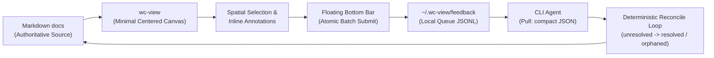

# wc-view: local Markdown review surface for agent workflows

## Status

proposed

## Context

- `workflow-contract` keeps Markdown documents as the authority for proposals, design, planning, and execution.
- CLI-agent users must currently locate and read Markdown in an editor or host-specific artifact UI.
- The same review surface must work with Codex, Claude Code, Pi, OpenCode, Cursor, Antigravity, and other terminal-first agents.

## Problem

- Editor previews optimize reading, not orientation, comparison, visual understanding, or precise review feedback.
- Host-specific artifacts do not provide a portable interaction contract across different CLI agent harnesses.
- Standard chat panels (heavy left/right sidebars) clutter reading space and pull focus away from the document.
- Generic unstructured chat prompts leave the agent to infer which element feedback refers to, producing spatial/reference errors.
- Generated viewer state in a repository creates unwanted diffs and commit noise.

## Proposed Change

Create an independent CLI named `wc-view`.

- Render Markdown files or a `docs/` tree in a lightweight localhost browser UI.
- Keep Markdown and explicit human acceptance authoritative. Browser feedback is unapproved input.
- **Minimalist Canvas Layout**: Full-width centered document reading area (`68-76ch`) with zero sidebars.
- **Element Selection & Robust Spatial Annotations**:
  - Allow users to select text or click elements (paragraphs, code blocks, tables, Mermaid nodes) to attach inline notes.
  - Bind each annotation with a **layered anchor** (following the W3C Web Annotation Data Model and Hypothes.is fuzzy-anchoring), resolved by ordered fallback:
    - **Primary — quote + context**: `exact` selected text plus ~32-char `prefix`/`suffix`, taken over the *rendered* text. This is the only tier that survives the agent rewrites this workload continuously produces.
    - **Secondary — structural scope narrower**: nearest stable heading slug + element type + occurrence index, used to disambiguate and cheaply bound the fuzzy search, not to locate.
    - **Tertiary — position hint**: `line_range` / offset kept only as a fast-path cache, re-validated against the quote on every load and never trusted alone.
  - This grounds each note to a concrete, robustly-resolvable span so the agent acts on the intended target rather than inferring it, **reducing spatial/reference ambiguity** (it does not eliminate content hallucination).
  - When an anchor no longer resolves (span deleted or rewritten past fuzzy recognition), mark the annotation `orphaned` rather than silently mis-anchoring.
  - Highlight annotated elements with a subtle visual indicator (`border-left: 3px solid var(--ring-accent); background: rgba(209, 207, 192, 0.06)`).
- **Central Floating Bottom Input Bar (deliberate minimal surface)**:
  - Replaces traditional sidebars with a floating bottom pill/card. The bottom-bar affordance follows Google Docs + Gemini; the removal of a persistent chat sidebar is a **deliberate divergence** from the converged SOTA pattern (Canvas, Artifacts, Cursor, and Copilot all retain a full-history side panel), justified by this being a focused local review tool rather than a consumer chat product — not a claim that "no sidebar" is itself the SOTA pattern.
  - Displays **only the latest message/status** from the agent in a compact top toast (expandable on click), paired with a lightweight persistent affordance to recover prior turns and list all pending annotations, so history is reduced but never lost.
  - Displays active selection chip badges (e.g. `[ 🏷️ 3 notes attached ]`).
  - **Atomic Feedback Batching**: Submits all accumulated inline notes and prompt instructions into a single atomic write to the local queue.
- **Decoupled Asynchronous Agent Payload Contract**:
  - Terminal agent execution is completely decoupled from the browser review surface.
  - Written to durable user-local state under `~/.wc-view/feedback/queue.jsonl` (never polluting git repositories).
  - No cross-harness standard yet exists for portable human→agent review feedback (MCP elicitation is agent-initiated and session-scoped; AGENTS.md carries static instructions, not per-item feedback) — this contract is **greenfield**. To keep future interop open, shape each feedback item on an established finding schema (SARIF / LSP `Diagnostic` / Reviewdog RDFormat): location anchor + message + severity.
  - Agent pulls structured, low-token feedback payloads on demand (`wc-view feedback --unresolved`). **Default payload format is compact JSON** — universally parseable and smallest on the nested, irregular shape of review feedback. A `--format` flag may offer alternatives (e.g. `toon`, CSV/Markdown table), adopted only where a benchmark on the real schema shows a stable, worthwhile token win.
  - **Deterministic Reconcile Loop**: Tracks feedback lifecycle (`unresolved` → `in_progress` → `resolved`, plus `orphaned` when an anchor no longer resolves) for agent task verification.
- **Sleek Minimal Design System & Theme Adaptation**:
  - **Shortest-Path Theme Strategy**: Built entirely using CSS Custom Properties (`var(--bg-base)`, `var(--fg-primary)`, etc.) bound to native `@media (prefers-color-scheme)` queries and a lightweight `[data-theme="dark"|"light"]` attribute toggle.
  - Palette (Dark Default): Base (`#121212`), surface cards (`#1C1C1C`), subtle borders (`#2C2C2C`), warm champagne ring accents (`#D1CFC0`), and accent highlights (`#F26A4B`, `#D9CFC2`, `#8E8A83`).
  - Palette (Light Mode): Base (`#FCFCFC`), surface cards (`#FFFFFF`), subtle borders (`#E4E4E7`), dark slate ring accents (`#18181B`), and subtle zinc accents.
  - Typography: Sans (`Inter`), Mono (`JetBrains Mono`), Serif accent (`Playfair Display`), with tight `0.01em` tracking.
  - Geometry: `0.5rem` (8px) radius, `0.25rem` (4px) grid spacing, soft ambient shadows (`0 6px 15px rgba(0,0,0,0.30)`).
- **Core Web Vitals & Accessibility (a11y)**:
  - Zero external CDN dependencies; pre-compiled CSS and system fallback font stacks (`font-display: swap`).
  - Fast interaction: target INP well inside Google's "good" threshold of ≤ 200 ms (p75); drive layout shift toward CLS = 0 — comfortably inside the "good" CLS threshold of ≤ 0.1 — by pre-reserving element heights for SVGs and code blocks.
  - Meet WCAG 2.2 AA. Use native HTML controls before ARIA; use semantic landmarks for document, review queue, composer, and status.
  - Preserve reading-order focus. The document remains reachable without entering review controls; a visible native "Add review note" control and an optional documented shortcut focus the composer.
  - Make every annotation keyboard-reachable. Enter or Space opens its editor; queued notes are a navigable list with remove and edit actions.
  - Treat the floating composer as non-modal. It never traps focus. Escape closes an annotation editor, preserves its draft, and returns focus to the invoking text or control.
  - Use a correctly labelled modal dialog only for destructive confirmation. Trap focus while open, provide a visible Cancel control, and restore invoking focus on close.
  - Announce submitted, claimed, response-proposed, orphaned, and failed feedback changes through a concise `aria-live="polite"` status region. Never convey state by color alone.
  - Provide visible focus indicators, 44 CSS-pixel minimum targets for pointer controls, keyboard-equivalent alternatives for every pointer action, and reduced-motion support.

## Expected Design Impact

Upon acceptance of this proposal, the following authoritative design documents will be created under `docs/design/`:
1. `docs/design/product/ux-design-system.md` (or `DESIGN.md` link): Defines full token specifications, CSS variables, typography scales, light/dark themes, and elevation rules.
2. `docs/design/interfaces/floating-bar-interaction-spec.md`: Specifies the bottom-floating input bar, review-status affordance, annotation popovers, focus order, keyboard behavior, and modal boundaries.
3. `docs/design/data/feedback-schema.md`: Defines the compact-JSON feedback schema for layered-anchored annotations (quote+context primary anchor, structural scope narrower, position-hint cache; `comment`; `status` including `orphaned`), shaped for SARIF / LSP-style interop.
4. `docs/design/interfaces/cli-contract.md`: Defines CLI commands (`wc-view serve`, `wc-view feedback --unresolved [--format <json|toon|...>]`, `wc-view gc`).

## Expected Implementation Impact

- New independent repository/package; no changes to the `workflow-contract` runtime.
- Later optional `workflow-contract` skill guidance may invoke `wc-view`; it must not duplicate viewer logic.
- No implementation tasks or code creation until this proposal is explicitly accepted and design documents exist.

## Open Decisions

- Supported Markdown dialect and Mermaid rendering baseline (also fixes the rendered-text coordinate space that anchors resolve against).
- Feedback retention lifecycle and `wc-view gc` automatic cleanup triggers.
- Queue mutation model: append-only JSONL with folded state-transition events vs Maildir-style file moves for in-place status changes.
- Localhost trust model (loopback-only bind; who may POST feedback) and concurrency handling for simultaneous writers.
- Single-document view vs docs-tree navigation tabs in V1.

