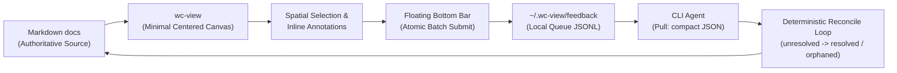

# wc-view: System Flow

## Context

- System-level view of how a Markdown document moves through `wc-view` and back, as stated in the accepted proposal.
- Referenced by `docs/design/product/ux-design-system.md`, `docs/design/interfaces/floating-bar-interaction-spec.md`, `docs/design/data/feedback-schema.md`, and `docs/design/interfaces/cli-contract.md`.

## Requirements

## Decisions

- Markdown remains the authoritative source at both ends of the loop; the queue and the reconcile loop are intermediate, non-authoritative state.

## Contracts

- Queue mutation model and CLI agent pull behavior beyond "compact JSON" are open — see `docs/changes/proposed/wc-view-open-decisions.md`.

## Acceptance Criteria

- Every stage in the diagram maps to a design doc: canvas/selection → `product/ux-design-system.md` + `interfaces/floating-bar-interaction-spec.md`; queue → `data/feedback-schema.md`; CLI agent pull → `interfaces/cli-contract.md`.
