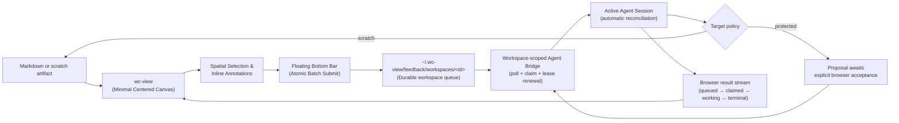

# wc-view: System Flow

## Context

- System-level view of how a Markdown document moves through `wc-view` and back.
- Referenced by `docs/design/product/ux-design-system.md`, `docs/design/interfaces/floating-bar-interaction-spec.md`, `docs/design/data/feedback-schema.md`, `docs/design/interfaces/cli-contract.md`, and `docs/design/architecture/tech-stack.md`.

## Requirements

## Decisions

- Markdown remains the authoritative source at both ends of the loop; the queue, bridge, and reconcile loop are intermediate, non-authoritative state.
- Browser batch submission is the trigger for a connected workspace-scoped agent bridge; no second terminal or chat prompt is required.
- Durable queue polling dispatches bridge work; SSE projects persisted status and results to the browser.
- Queue polling survives server, browser, and bridge disconnects. SSE does not replace durable claims, leases, retries, or replay.
- Scratch artifacts may be changed automatically.
- Repository-authoritative Markdown, source code, configuration, and external side effects require explicit human acceptance before mutation.

## Contracts

- The bridge adapter command is runtime-specific.
- The core CLI defines durable batch and result protocol without coupling to a particular agent harness.
- Workspace queue identity and target validation are server-owned.
- Protected-target policy assumes a trusted local adapter; it is not an operating-system sandbox.

## Acceptance Criteria

- Every stage in the diagram maps to a design doc: canvas/selection → `product/ux-design-system.md` + `interfaces/floating-bar-interaction-spec.md`; queue → `data/feedback-schema.md`; bridge and result stream → `interfaces/cli-contract.md`.
- A bridge cannot claim records outside its configured workspace.
- Browser reconnects recover target-scoped state from the durable queue before receiving live SSE updates.
